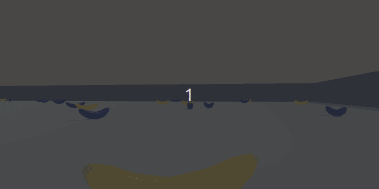

# Udacity Project: Navigation



## Description
The goal of this project is to resolve __one-agent environment__ using __Reinforcement Learning Value-Based Method__.

### Environment
The environment is similar to _Banana Collector_ environment provided by __Unity ML-Agents__.
An agent is placed in a large, squared world and its goal is to collect as many as possible yellow bananas, 
while avoiding blue bananas. Environment is considered as resolved in training process 
when an agent gets an average score of __+13 over 100 consecutive episodes__.

### State

The state space of environment is built from __37-dimension vector__ that includes the agent's velocity, 
along with ray-based perception of objects around the agent's forward direction.

### Action
An agent is responsible for deciding, based on provided _environment state space_ 
what action should be taken to get the best score. An agent is allowed to take one of following actions:  

- `0` - move forward  
- `1` - move backward  
- `2` - turn left  
- `3` - turn right  

### Reward  

- a reward of __+1__ point is provided when agent has collected __yellow banana__  
- a reward of __-1__ point is provided when agent has collected __blue banana__  


## Algorithm Description
All details related to algorithm utilized to resolve this problem can be found in [Report.md file](./Report.md).

## Structure description
In the project can be found following files:  

| Filename           | Description                                                                    |
|--------------------|--------------------------------------------------------------------------------|
| `agent.py`         | implementation of agent                                                        |
| `doc`              | folder that contains docs related files                                        |
| `environment.py`   | wrapper class for _UnityEnvironment_ to simplify interactions with environment |
| `model.py`         | Pytorch-based implementation of _Q-network_                                    |  
| `Report.md`        | doc file that contains utilized algorithm's details                            |  
| `requirements.txt` | file that contains all required Python dependencies                            |  
| `README.md`        | doc file that contains project's description                                   | 
| `test.py`          | Python script that allows to start trained agent                               |
| `train.py`         | main Python script for training                                                |
| `model_weights.pt` | file that contains weights of _Q-network_                                      |

## Try it yourself

### Dependencies

- [Python 3.X](https://www.python.org/downloads/)  
- [git](https://git-scm.com/downloads)  

First clone repository:
```shell
git clone https://github.com/karolcymerys/udacity-reinforcement-learning-navigation-problem.git
```

In order to install all required Python dependencies, please run below command:

```shell
pip install -r requirements.txt
```

Next, install custom _UnityAgents_ and its dependencies:
```shell
git clone https://github.com/udacity/Value-based-methods.git
cd Value-based-methods/python
pip install . 
```
Please note that it might be required to remove packages versions from 
`Value-based-methods/python/requirements.txt` to successfully install these dependencies,
but `protobuf` must be used in version `3.20.0`. 

At the end, download _Unity Environment_ for your platform:

- [Linux](https://s3-us-west-1.amazonaws.com/udacity-drlnd/P1/Banana/Banana_Linux.zip)  
- [Mac OSX](https://s3-us-west-1.amazonaws.com/udacity-drlnd/P1/Banana/Banana.app.zip)  
- [Windows (32-bit)](https://s3-us-west-1.amazonaws.com/udacity-drlnd/P1/Banana/Banana_Windows_x86.zip)  
- [Windows (64-bit)](https://s3-us-west-1.amazonaws.com/udacity-drlnd/P1/Banana/Banana_Windows_x86_64.zip)  

Once ZIP package is downloaded, please unzip it and place files in archive to root folder. 
Please note, that you may need to adjust `filename` parameter of `TrainNavigationEnvironment` class 
(it depends on platform you use).

### Training

Feel free to train your own agent. In order to do that:  

1. In `train.py` file adjust hyperparameters  
2. Run `python train.py` to start training process  
3. Once training is completed, then your network is saved in `model_weights.py` file  

### Testing
1. In order to run trained agent, run following command `python test.py`
 (it utilizes model weights from `model_weights.py` file)  