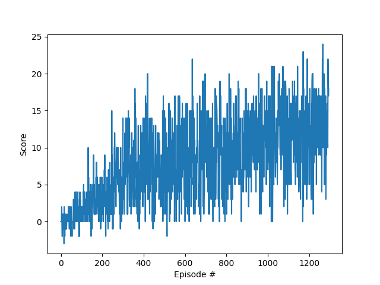

# Implementation details
___

In order to resolve defined problem there was applied [Double Q-learning technique](https://arxiv.org/abs/1509.06461).
Its goal is to maximize expected cumulative reward based on provided state by taking appropriate actions. 
To achieve this goal there are applied two _Q-Networks_ (_local_ and _target_) with the same structure, but different 
internal parameters (model's weights).
Their task is to predict _Q-value_ for all of defined actions based on provided environment's state.

In training procedure there is applied _ϵ-greedy_ technique that is utilized to collect experience samples 
that can be used to train _Q-Networks_. They are stored in _experience replay buffer_. 

At the beginning of the training there are applied random actions. 
With getting more experience there is utilized _local Q-Network_ to select actions with the biggest _Q-value_ for provided state. 
It's controlled by _ϵ_ parameter that is decreased during training procedure.  

Periodically, weights of _Q-Networks_ are adjusted using _back-propagation algorithm_ with pre-defined learning rate 
`µ` to achieve better score with following loss function:

aoptimal =  argmax a ϵ A Qtlocal(St+1, a)  
Qtexpected = Rt+1 + γQttarget(St+1, aoptimal)

where _A_ is set of allowed actions, _t_ is time, _St+1_ is next state, _Rt+1_ is reward, 
_γ_ is gamma parameter and _Qtarget_, _Qlocal_ are _Q-networks_.

Above loss function allows to improve _Q-network_ by maximizing expected reward for given environment's state.

Also, as part of training procedure weights of _local Q-Network_ are used to modify weights of _local Q-Network_ with parameter `τ`.

Training procedure is repeated until goal is archived.

## Q-Network Model architecture

In order to estimate Q function there was used _Artificial Neural Network_ (ANN). This models:  

- accepts input vector that contains state of the environment  (input layer size must be the same as environment state size - 37)  
- contains hidden layer that contains 5x more cells than input layer  
- as an output there is predicted Q value for each of the allowed actions (output size is 4)  
- an implementation can be found in [model.py file](model.py)  

## Utilized hyperparameters

| Parameter         | Value  |
|-------------------|--------|
| gamma `γ`         | 0.9    |
| tau `τ`           | 0.001  |
| learning rate `µ` | 0.0005 |
| buffer size       | 100,000|

## Plot of rewards

Environment was resolved with __1295 episodes__.

## Ideas for improvements

- Improve model architecture by using [dueling DQN](https://arxiv.org/abs/1511.06581)  
- Improve training process by applying [Prioritized Experience Replay](https://arxiv.org/abs/1511.05952)  
- Use tool to optimize hyperparameters (such as [Optuna](https://optuna.org/))

[[1] Human-level control through deep reinforcement learning](https://storage.googleapis.com/deepmind-media/dqn/DQNNaturePaper.pdf)  
[[2] Deep Reinforcement Learning with Double Q-learning](https://arxiv.org/abs/1509.06461)